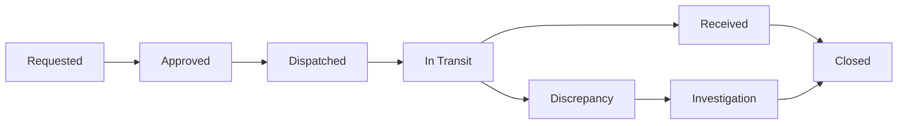
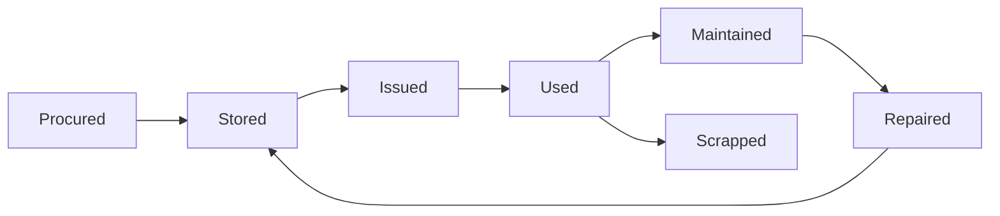
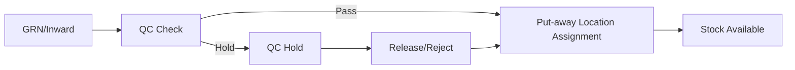

# Store & Inventory Intelligence Module (Enterprise ERP Design)

## 1) Design Scope

This module is designed as an **Enterprise Inventory Intelligence System** for multi-location, safety-critical operations.

Supports:
- Central warehouse
- Site stores
- Vehicle/mobile stores
- Technician-issued inventory
- Transit stock
- Repair lifecycle
- Safety equipment compliance

Core goals:
- Real-time stock visibility
- End-to-end lifecycle traceability
- Controlled movement and transit
- Predictive intelligence and alerting
- Tight ERP integration with procurement, finance, gate pass, projects, HR, maintenance

---

## 2) Six-Layer Architecture

### Layer A: Master Layer
- Store master with hierarchy and geo-coordinates
- Item master (asset + consumable unified)
- Category hierarchy (multi-level taxonomy)
- Location master (rack/bin/yard/cage/vehicle compartment)
- Reference master: UOM, criticality, lifecycle types, reorder policies

### Layer B: Transaction Layer
- Inward engine
- Outward/issue engine
- Return handling
- Stock adjustments and reconciliations
- Batch/serial/QC/put-away support

### Layer C: Movement & Transit Layer
- Inter-store transfer workflow orchestration
- Gate pass linkage
- Dispatch and transit monitoring with ETA and SLA
- Shipment grouping and transport linkage

### Layer D: Control & Lifecycle Layer
- Item instance status-state model
- Repair lifecycle orchestration
- Calibration and expiry controls
- Exception controls (blocked, QC hold, discrepancy)

### Layer E: Predictive & Analytics Layer
- Reorder forecast and safety stock optimization
- Consumption and failure trends
- Slow/dead stock, expiry risk, calibration due prediction
- Project demand forecast and readiness scoring

### Layer F: Reporting & Dashboard Layer
- Executive dashboards
- Store operations dashboards
- Movement, valuation, compliance and reconciliation reports
- Audit and forensic traceability

---

## 3) Database Architecture (Production Model)

## 3.1 Core Masters

### `inv_store_master`
- `id (uuid, pk)`
- `store_code (varchar, unique)`
- `store_name (varchar)`
- `store_type (enum: CENTRAL, SITE, PROJECT, VEHICLE, TECHNICIAN)`
- `parent_store_id (uuid, fk inv_store_master.id, nullable)`
- `geo_lat (numeric)`
- `geo_lng (numeric)`
- `address_json (jsonb)`
- `capacity_qty (numeric)`
- `capacity_value (numeric)`
- `incharge_user_id (uuid, fk profiles.id)`
- `status (enum: ACTIVE, INACTIVE, BLOCKED)`
- `created_at, updated_at`

Indexes:
- `(store_type, status)`
- `(parent_store_id)`
- GIN index on `address_json`

### `inv_item_master`
- `id (uuid, pk)`
- `item_code (varchar, unique)`
- `item_name (varchar)`
- `category_id (uuid, fk inv_category_master.id)`
- `subcategory_id (uuid, fk inv_category_master.id, nullable)`
- `specification_json (jsonb)`
- `brand (varchar)`
- `uom_id (uuid, fk inv_uom_master.id)`
- `hsn_code (varchar)`
- `item_type (enum: ASSET, TOOL, CONSUMABLE, SPARE, SAFETY_EQUIPMENT)`
- `is_serialized (boolean)`
- `lifecycle_type (enum: REPAIRABLE, DISPOSABLE, RETURNABLE)`
- `shelf_life_days (int, nullable)`
- `warranty_days (int, nullable)`
- `calibration_required (boolean)`
- `criticality_level (enum: LOW, MEDIUM, HIGH, SAFETY_CRITICAL)`
- `reorder_policy_id (uuid, fk inv_reorder_policy.id)`
- `financial_category (enum: INVENTORY, FIXED_ASSET, EXPENSE, CAPITAL_WIP)`
- `status (enum: ACTIVE, INACTIVE)`
- `created_at, updated_at`

Indexes:
- `(item_type, criticality_level)`
- `(category_id, subcategory_id)`
- GIN on `specification_json`

### `inv_category_master`
- `id (uuid, pk)`
- `parent_id (uuid, fk inv_category_master.id, nullable)`
- `category_code (varchar, unique)`
- `category_name (varchar)`
- `category_level (int)`
- `status (enum: ACTIVE, INACTIVE)`

### `inv_location_master`
- `id (uuid, pk)`
- `store_id (uuid, fk inv_store_master.id)`
- `location_type (enum: RACK, BIN, YARD, CAGE, VEHICLE_COMPARTMENT)`
- `location_code (varchar)`
- `description (varchar)`
- `is_default_putaway (boolean)`
- `status (enum: ACTIVE, INACTIVE)`
- unique `(store_id, location_code)`

---

## 3.2 Stock and Instance Tables

### `inv_stock_balance`
- `id (uuid, pk)`
- `store_id (uuid, fk)`
- `item_id (uuid, fk)`
- `location_id (uuid, fk, nullable)`
- `batch_no (varchar, nullable)`
- `expiry_date (date, nullable)`
- `qty_available (numeric)`
- `qty_reserved (numeric)`
- `qty_in_transit_in (numeric)`
- `qty_in_transit_out (numeric)`
- `qty_qc_hold (numeric)`
- `qty_blocked (numeric)`
- `last_movement_at (timestamptz)`
- unique composite: `(store_id, item_id, location_id, batch_no, expiry_date)`

### `inv_item_instance`
For serialized tools/assets/safety units.
- `id (uuid, pk)`
- `item_id (uuid, fk)`
- `serial_no (varchar, unique)`
- `current_store_id (uuid, fk)`
- `current_location_id (uuid, fk, nullable)`
- `instance_status (enum: AVAILABLE, RESERVED, ISSUED, IN_TRANSIT, UNDER_REPAIR, SCRAPPED, QC_HOLD, BLOCKED)`
- `warranty_expiry_date (date, nullable)`
- `calibration_due_date (date, nullable)`
- `last_service_date (date, nullable)`
- `last_known_user_id (uuid, fk profiles.id, nullable)`
- `metadata_json (jsonb)`

---

## 3.3 Transaction and Movement Tables

### `inv_txn_header`
- `id (uuid, pk)`
- `txn_no (varchar, unique)`
- `txn_type (enum: INWARD, OUTWARD, RETURN, ADJUSTMENT, TRANSFER, REPAIR)`
- `sub_type (varchar)` 
- `source_store_id (uuid, nullable)`
- `destination_store_id (uuid, nullable)`
- `txn_date (timestamptz)`
- `reference_module (enum: PROCUREMENT, GATE_PASS, PROJECT, MAINTENANCE, FINANCE, HR, VEHICLE)`
- `reference_id (uuid, nullable)`
- `status (enum: DRAFT, REQUESTED, APPROVED, DISPATCHED, IN_TRANSIT, RECEIVED, CLOSED, CANCELLED, DISCREPANCY)`
- `approved_by (uuid, nullable)`
- `remarks (text)`

### `inv_txn_line`
- `id (uuid, pk)`
- `txn_id (uuid, fk inv_txn_header.id)`
- `item_id (uuid, fk)`
- `batch_no (varchar, nullable)`
- `serial_instance_id (uuid, fk inv_item_instance.id, nullable)`
- `qty (numeric)`
- `uom_id (uuid, fk)`
- `from_location_id (uuid, nullable)`
- `to_location_id (uuid, nullable)`
- `line_status (enum: OK, SHORT, EXCESS, DAMAGED, REJECTED)`
- `qc_required (boolean)`
- `qc_status (enum: PENDING, HOLD, RELEASED, REJECTED)`

### `inv_transfer_shipment`
- `id (uuid, pk)`
- `shipment_no (varchar, unique)`
- `transfer_request_id (uuid, fk inv_txn_header.id)`
- `vehicle_id (uuid, fk vehicle_master.id, nullable)`
- `gate_pass_id (uuid, fk gate_pass.id, nullable)`
- `dispatch_time (timestamptz, nullable)`
- `eta (timestamptz, nullable)`
- `received_time (timestamptz, nullable)`
- `transit_status (enum: DISPATCHED, IN_TRANSIT, DELAYED, RECEIVED, DISCREPANCY)`

---

## 3.4 Lifecycle, Repair, Compliance Tables

### `inv_repair_job`
- `id (uuid, pk)`
- `instance_id (uuid, fk inv_item_instance.id)`
- `repair_out_txn_id (uuid, fk inv_txn_header.id)`
- `vendor_id (uuid, nullable)`
- `issue_reported (text)`
- `job_status (enum: SENT, IN_REPAIR, REPAIRED, RETURNED, SCRAPPED)`
- `cost (numeric)`
- `tat_days (int)`
- `return_txn_id (uuid, fk inv_txn_header.id, nullable)`

### `inv_compliance_event`
- `id (uuid, pk)`
- `instance_id (uuid, fk)`
- `event_type (enum: CALIBRATION_DUE, CALIBRATION_DONE, EXPIRY_ALERT, EXPIRY_BREACH, SAFETY_AUDIT)`
- `event_date (timestamptz)`
- `due_date (date, nullable)`
- `status (enum: OPEN, COMPLETED, WAIVED, OVERDUE)`
- `notes (text)`

---

## 3.5 Alert and Analytics Tables

### `inv_alert_event`
- `id (uuid, pk)`
- `alert_type (enum: LOW_STOCK, EXCESS_STOCK, NO_MOVEMENT, EXPIRY, CALIBRATION_DUE, TRANSIT_DELAY, NOT_RETURNED, ABNORMAL_CONSUMPTION)`
- `severity (enum: INFO, WARNING, HIGH, CRITICAL)`
- `store_id (uuid, nullable)`
- `item_id (uuid, nullable)`
- `instance_id (uuid, nullable)`
- `message (text)`
- `triggered_at (timestamptz)`
- `resolved_at (timestamptz, nullable)`
- `owner_user_id (uuid, nullable)`

### `inv_forecast_snapshot`
- `id (uuid, pk)`
- `snapshot_date (date)`
- `store_id (uuid)`
- `item_id (uuid)`
- `predicted_daily_consumption (numeric)`
- `predicted_reorder_date (date)`
- `recommended_order_qty (numeric)`
- `safety_stock_recommended (numeric)`
- `confidence_score (numeric)`

---

## 4) API Structure

Base namespace: `/api/v1/inventory`

## 4.1 Master APIs
- `POST /stores`, `GET /stores`, `GET /stores/:id`, `PATCH /stores/:id`
- `POST /items`, `GET /items`, `GET /items/:id`, `PATCH /items/:id`
- `POST /categories`, `GET /categories/tree`
- `POST /locations`, `GET /stores/:id/locations`

## 4.2 Stock APIs
- `GET /stock/balance?store_id=&item_id=`
- `GET /stock/ledger?store_id=&item_id=&from=&to=`
- `GET /stock/instances/:serial_no`

## 4.3 Transaction APIs
- `POST /inward`
- `POST /outward`
- `POST /returns`
- `POST /adjustments`
- `POST /transfers/request`
- `POST /transfers/:id/approve`
- `POST /transfers/:id/dispatch`
- `POST /transfers/:id/receive`
- `POST /transfers/:id/discrepancy`

## 4.4 Lifecycle APIs
- `POST /repairs/outward`
- `POST /repairs/:id/receive`
- `GET /repairs/:id`
- `POST /compliance/calibration`
- `GET /compliance/due`

## 4.5 Alert & Analytics APIs
- `GET /alerts`
- `POST /alerts/:id/ack`
- `GET /analytics/reorder-forecast`
- `GET /analytics/slow-dead-stock`
- `GET /analytics/consumption-trend`
- `GET /analytics/project-demand`

## 4.6 Dashboard APIs
- `GET /dashboard/management`
- `GET /dashboard/store-manager?store_id=`
- `GET /dashboard/operations`

---

## 5) Workflow Diagrams

### 5.1 Transfer Lifecycle

### 5.2 Item Lifecycle

### 5.3 Inward to Put-away

---

## 6) UI Screen Hierarchy

Top-level:
1. Inventory Dashboard
2. Store Network View
3. Item Master Management
4. Inward Entry
5. Issue Screen
6. Transfer Screen
7. Transit Tracking Screen
8. Lifecycle View
9. Alerts Center
10. Predictive Insights View
11. Reporting Console

### Recommended navigation grouping
- **Masters**: Stores, Items, Categories, Locations, Policies
- **Operations**: Inward, Outward, Return, Transfer, Transit
- **Control**: Lifecycle, Repair, Compliance
- **Intelligence**: Alerts, Predictive Insights, Optimization
- **Reporting**: Ledgers, Valuation, Movement, Readiness, Scrap

---

## 7) Predictive Logic Architecture

Inputs:
- Historical issue/outward consumption
- Lead-time by vendor/store lane
- Store-wise service/project demand
- Failure and repair history
- Expiry and calibration schedules

Models:
- Moving average + seasonal decomposition for base consumption
- Safety stock formula with demand/lead-time variability
- Z-score anomaly detection for abnormal consumption
- Dead stock classifier: no movement + aging + criticality + value bands

Outputs:
- Reorder date and quantity
- Stockout risk score
- Excess/obsolete risk score
- Readiness score (site and vehicle)
- Forecast confidence index

---

## 8) Integration Mapping

## Procurement
- PO/GRN inbound, lead-time capture, supplier quality and delay metrics

## Finance
- Inventory valuation (FIFO/weighted average), capitalization, consumption posting, scrap accounting

## Gate Pass
- Dispatch authorization, outbound lock, return gate validation

## Vehicle Module
- Vehicle as mobile store, route stock, readiness and replenishment sync

## Project Module
- Site demand plans, project allocations, issue reservations

## HR Module
- Technician tool issue, return accountability, loss/damage mapping

## Maintenance Module
- Repair workflows, maintenance schedule and service logs

## Asset Register
- Asset capitalization and lifecycle sync

---

## 9) Role Access Matrix

| Role | Master | Transactions | Approvals | Analytics | Reports | Admin |
|------|--------|--------------|-----------|-----------|---------|-------|
| Store Keeper | View/Edit limited | Full ops | No | View own | Standard | No |
| Store Manager | Full store | Full ops | Yes | Full store | Full store | No |
| Site Incharge | Request + receive | Site only | Limited | Site view | Site reports | No |
| Operations Head | View | Oversight | Yes | Full ops | Full ops | No |
| Procurement Officer | Item/policy view | Replenishment | Yes | Forecast/reorder | Procurement reports | No |
| Finance Controller | Valuation masters | Audit-linked | Yes | Value analytics | Financial reports | No |
| Auditor | Read-only | Read-only | No | Read-only | Full audit | No |
| System Admin | Full | Full | Full | Full | Full | Full |

---

## 10) Reporting Catalog

- Stock ledger
- Movement history
- Store-wise stock
- Category-wise stock
- Transit report
- Consumption report
- Dead stock report
- Expiry report
- Calibration report
- Scrap report
- Inventory valuation
- Site allocation report

---

## 11) Scalability and Compliance Controls

- Multi-country ready: org/company/country partition key in transactional tables
- Regional tax and financial category abstraction
- Safety-critical lock rules (expiry/calibration non-compliant items auto-block issue)
- Full event audit trail (immutable transaction log recommended)
- Async event bus for integrations and alerting at scale

---

## 12) Implementation Notes for Current ERP

- Current route entry: `/app/store-inventory`
- Keep existing UI pattern: Tailwind cards, table grids, sidebar-compatible structure
- Rollout path:
  1. Masters + stock ledger
  2. Inward/outward + transfer + gate pass links
  3. Repair/compliance + alert engine
  4. Predictive layer + advanced dashboards

