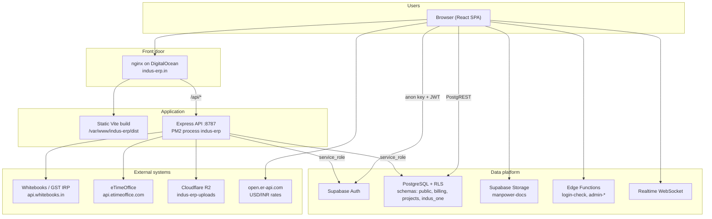
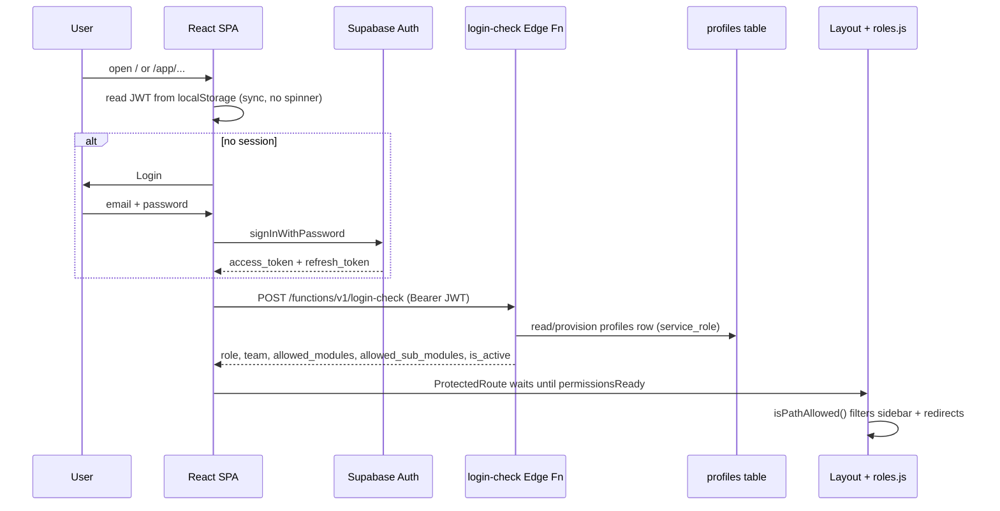
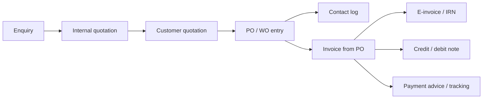

# Indus ERP Core — System Architecture and Working Model

**Project:** ERP-modules-Indus-company  
**Product:** INDUS ERP CORE (internal ERP for Indus Fire Safety Pvt. Ltd. / IFSPL)  
**Audience:** Developers, IT, QA, deployment and support  
**Live production:** https://indus-erp.in  
**Companion docs:** [PROJECT_DOCUMENTATION.md](../PROJECT_DOCUMENTATION.md) (overview and handover), [ARCHITECTURE.md](./ARCHITECTURE.md) (frontend folder layout and code-splitting)

This document is the detailed architecture: how the pieces run, which APIs exist, which external systems are connected, and how each business module actually works.

---

## 1. What this system is

INDUS ERP CORE is a single React SPA plus a Node API on two isolated Supabase projects (production and staging). It is not a generic ERP. It is built around fire-safety commercial work:

- Manpower / training contracts
- R&M / M&M / AMC / IEV
- Fire-tender costing and projects
- GST e-invoicing
- Site payroll and office HR
- Fleet, site operations, and finance

There is no GraphQL, no Firebase, and no mobile app in this repo. It is a web ERP.

---

## 2. High-level architecture



**Design split**

- The **browser never holds** Whitebooks, eTimeOffice, or R2 secrets. Those stay on the Node process.
- The browser talks to Postgres with the **anon key + user JWT**. Row Level Security (RLS) is the real gate.
- Everyday CRUD is **SPA → PostgREST**. Privileged or secret work is **SPA → Node `/api`**.

---

## 3. Runtime topology

Three environments, never mixed:

| | Production | Staging | Local |
|---|---|---|---|
| URL | `https://indus-erp.in` | staging host (separate deploy script) | Vite `localhost:5173` |
| Supabase project | `wbyzhknaqcjqqtwopupl` | `xjzhlbpgnpcmbdlufhwo` | whichever `.env` you load |
| Frontend | `npm run build` → nginx `dist` | `npm run build:staging` | `vite` |
| API | PM2 `indus-erp` on same box; `/api` reverse-proxied | `ERP_ENV=staging` | Express on **8787**; Vite proxies `/api` |
| Secrets | `.env.server` on the box | `.env.server.staging` | `.env` + `.env.server` |

The Node server **auto-pins** production vs staging Supabase so a leftover staging URL cannot be used with a production service-role key (and vice versa). Mixing them is a known failure mode: Raw Attendance sync returns 401.

Optional extra host: **Render** (`render.yaml`) can run the same Express app as `erp-einvoice-api` if the SPA is on a static host that cannot proxy `/api`. Then set `VITE_API_BASE_URL` to that origin.

**Local commands**

- Production-shaped local: `npm run dev` (Vite + Node together)
- Staging-shaped local: `npm run dev:staging`
- API only: `npm run server` (port 8787)
- Frontend only: `npm run dev:frontend` (needs the API if `/api` is used)

Vite proxies `/api` to `http://127.0.0.1:8787` (IPv4 on purpose, to avoid Windows `localhost` resolving to `::1`).

---

## 4. Technology stack

**Frontend**

- React 18, Vite 5, React Router 6
- Tailwind CSS, Lucide / React Icons
- jsPDF + autotable, html2canvas, ExcelJS / xlsx / papaparse, QRCode, PizZip (DOCX)
- Recharts (API health and some dashboards)
- Route-level `lazy()` in `src/routes/lazyPages.jsx` + `Suspense` in Layout
- Vendor chunks: react, supabase, xlsx, jspdf, lucide (`vite.config.ts`)

**Backend (this repo)**

- Express 5 on port **8787** (`server/index.js`, launched by `scripts/run-server.mjs`)
- helmet, cors, express-rate-limit, multer
- `@aws-sdk/client-s3` for Cloudflare R2 (S3-compatible)
- `@supabase/supabase-js` with **service_role** for admin / attendance / session checks

**Platform**

- Supabase: Auth, PostgREST, Storage, Realtime, Edge Functions (Deno)
- Postgres schemas: `public`, `billing`, `projects`, `indus_one`
- Cloudflare R2 bucket `indus-erp-uploads`
- GitHub Actions CI + SSH deploy (`appleboy/ssh-action`)
- nginx + PM2 on DigitalOcean (`/root/indus-erp`, static at `/var/www/indus-erp/dist`)

---

## 5. How a request actually moves

### 5.1 Page load and session



- Identity is **Supabase Auth**.
- Authorization is **`public.profiles`**, not JWT claims alone.
- `login-check` is the source of truth after login: it provisions a profile for legacy users, syncs `app_users`, and returns role / team / modules.
- Auth user metadata is only a fallback if the edge function is slow or missing.
- Inactive accounts (`profiles.is_active = false`) and banned Auth users are blocked in the login path.

Public routes: `/`, `/forgot-password`, `/reset-password`. `/register` is **dev-only**. After login, `getLandingPathForUser()` picks the first allowed module (not always Dashboard). Settings is the safe fallback.

### 5.2 Everyday CRUD (most of the ERP)

Almost every screen does this:

1. `supabase.from('table')` or `supabase.schema('billing').from('po_wo')`
2. PostgREST applies RLS using `auth.uid()`
3. Custom fetch wrapper in `src/lib/supabase.js` adds timeouts, clearer network errors, and **batched activity logging** into `erp_activity_log`

The SPA is the application server for a lot of business logic (payroll formulas, invoice math, quotation costing). Postgres stores and gates; it does not run the whole payroll engine.

### 5.3 Privileged / secret operations (Node)

Browser → `fetch('/api/...')` with Bearer JWT → Express `authMiddleware` validates JWT against the **same** Supabase project → Node uses service_role or third-party credentials.

Auth on `/api/admin/*` uses the service-role client to `auth.getUser(jwt)`. If the production API is pointed at staging Supabase, this is exactly why attendance sync 401s.

---

## 6. Access control

Defined in `src/config/roles.js`.

| Role | Meaning |
|---|---|
| **Executive** | View/edit in assigned team/modules; no approvals |
| **Manager** | Same + approvals in that scope |
| **Admin** (also `hod`) | Dashboard + assigned modules; can approve inside those modules |
| **Super Admin** | Full modules including User Management |
| **Super Admin Pro** | Full access + bootstrap owner |

On top of role:

- **`team`** — home department (hr, billing, commercial, marketing, …). Maps to a default module.
- **`allowed_modules`** — extra whole modules.
- **`allowed_sub_modules`** — path prefixes such as `hr.attendance`, or tab keys such as `hr.recruitment.candidates`.
- **`module_access_pending`** — user exists but modules not granted yet (Settings-only until an admin assigns access).
- **Salary Admin** — extra allowlist (`canAccessSalaryAdmin`), not just “has admin module”.
- **Billing verticals** — even with Billing access, the user only sees Manpower / Training / R&M / M&M / AMC / IEV / Projects lines they are granted (`billing.user_vertical_grant`). Super Admin sees all.

Sidebar and deep links both go through `isPathAllowed()`. A user with a recognized role but **no** team/modules gets **Settings only** (no privilege-by-omission).

`erp_app_access_config` can override the teams/modules catalog at runtime (Realtime subscription on `id=eq.default`). If that table is empty, the SPA falls back to the hardcoded `NAV_MODULE_TREE`.

Canonical module keys (from `NAV_MODULE_TREE`): `hr`, `compliance`, `admin`, `commercialMt`, `commercialRm`, `marketing`, `maintenance`, `billing`, `operations`, `projects`, `procurement`, `amc`, `finance`, `fireTender`, `itIs`, plus `indusLms`, `overview`, `settings`, `userManagement`.

---

## 7. Frontend layout

```
src/
  main.tsx                 bootstrap, chunk-reload cleanup
  App.jsx                  all routes, date-input observer, ConnectionGuard
  routes/lazyPages.jsx     code-split map
  contexts/                Auth, Layout shell, Billing, Audit, AppAccessConfig
  config/roles.js          teams, modules, path guards
  lib/                     supabase client, API base, domain helpers
  services/                billingApi, eInvoiceApi, payrollApi, financeApi, …
  pages/                   one folder per business domain
  modules/payroll/         formula evaluator + statutory calc (pure JS)
  components/              shared chrome (ProtectedRoute, toasters, drawers)
```

**Shell:** `src/contexts/Layout.jsx` — logo, module accordion sidebar (filtered by permissions), header, PO approval bell, activity log, `<Outlet />`.

**Guards:** `ProtectedRoute` (must be signed in + permissions loaded). Layout then redirects disallowed paths. `SalaryAdminGuard` wraps salary-admin only.

**Keep-alive pattern:** Billing (and similar hubs) use a **single mounted route** such as `billing/*` so switching tabs does not remount the whole module. Operations, AMC, Finance, Commercial, and Admin salary work the same way: one parent component, path → tab map.

**Cross-cutting UI behaviour**

- Date inputs are globally patched in `App.jsx` (ISO, range, do not wipe while typing).
- PDF/Excel are generated in the browser (invoices, offers, IOM, payslips, attendance sheets, costing). No report server.
- Chunk deploys: `lazyWithRetry` + `_v` query param so users do not sit on stale hashed JS after a release.
- Diagnostics: `?diag=1` in dev runs `runBackendDiagnostics()`.

See [ARCHITECTURE.md](./ARCHITECTURE.md) for how to add a page (lazy export + `App.jsx` route).

---

## 8. Internal APIs (Node Express)

Base: same-origin `/api`, or `VITE_API_BASE_URL` if the API is hosted separately.

Helmet + CORS: `CORS_ORIGINS` must include `https://indus-erp.in` in production. Rate limits sit on `/api` generally, tighter on e-invoice.

| Method | Path | Who | What |
|---|---|---|---|
| GET | `/api/health` | public | Process up, Supabase URL/project, service_role status, R2 configured |
| GET | `/api/admin/attendance/status` | unauthenticated probe | eTimeOffice proxy configured? (no punches) |
| GET | `/api/admin/attendance/punches` | attendance admin JWT | Download punches from eTimeOffice |
| POST | `/api/admin/attendance/sync` | attendance admin JWT | Overlap sync → upsert into Postgres; optional cron |
| GET | `/api/admin/leave-requests` | HR/admin JWT | Leave inbox (service-role reads) |
| GET | `/api/admin/tour-requests` | HR/admin JWT | Tour inbox |
| POST | `/api/admin/update-profile` | admin JWT | Save profile (service_role; bypasses RLS pain) |
| POST | `/api/admin/create-user` | admin JWT | Auth user + profile bootstrap |
| POST | `/api/admin/bulk-create-users` | admin JWT | Excel / bulk import |
| POST | `/api/admin/bulk-delete-users` | admin JWT | Bulk delete |
| GET | `/api/debug/invoice/:id` | admin | Last Whitebooks payload snapshot |
| POST | `/api/billing/e-invoice/generate` | billing JWT + rate limit | Whitebooks IRN generate |
| POST | `/api/billing/e-invoice/cancel` | billing JWT | Whitebooks IRN cancel |
| POST | `/api/software-subscriptions/r2/upload` | session | Multipart → R2 `software-subscriptions/` |
| POST | `/api/software-subscriptions/r2/presign-get` | session | Signed download URL (~10 min) |
| POST | `/api/software-subscriptions/r2/delete` | session | Delete object |
| POST | `/api/fleet/r2/upload` | session | R2 `fleet/documents\|drivers/{userId}/…` |
| POST | `/api/fleet/r2/presign-get` | session | Signed GET; key must match caller |
| POST | `/api/hr-calling/r2/upload` | session | R2 `hr-calling/{userId}/{candidate}/…` |
| POST | `/api/hr-calling/r2/presign-get` | session | Signed GET |

**Known gap:** the frontend (`src/lib/commercialPoR2.js`) calls `/api/commercial-po/r2/upload` and a share URL `/api/commercial-po/f/:code`. Those routes are **not** in `server/index.js` today. PO file upload to R2 is designed but the Express side is missing unless it lives on another process.

Production canary: `GET https://indus-erp.in/api/health`. CI curls this after deploy. `service_role_key` must be `"ok"` or Raw Attendance sync will 401.

---

## 9. Supabase Edge Functions

Deployed on the Supabase project. Several have `verify_jwt = false` in `supabase/config.toml` and **verify the JWT inside the function** (ES256 gateway issues).

| Function | Role |
|---|---|
| `login-check` | Post-login profile + provision + `app_users` sync |
| `access-check` | Module access verification |
| `admin-create-user` | Create Auth user + profile |
| `admin-update-profile` | Profile save |
| `admin-delete-user` | Delete user |
| `admin-bulk-create-users` | Bulk create |
| `admin-bulk-delete-users` | Bulk delete |
| `admin-list-profiles` | List profiles (client often uses REST instead) |

User Management tries **Node first**, then falls back to the matching Edge Function. Same job, two hosts, because Edge is always on Supabase even if the Node API is down.

`send-email` is mentioned only in commented marketing code — **not deployed**.

---

## 10. External connections

### 10.1 Whitebooks → GST IRP (e-invoice)

**Purpose:** Indian GST e-invoicing: generate IRN, Ack No, Ack Date, QR; cancel IRN.

**Path:** Billing UI → `src/services/eInvoiceApi.js` → `POST /api/billing/e-invoice/generate` → Node authenticates to `https://api.whitebooks.in` → Whitebooks talks to the government IRP.

Credentials (`WHITEBOOKS_*`) are **server-only**. `VITE_EINVOICE_PROVIDER=backend` is the production setting. Direct browser Whitebooks is CORS-blocked and would leak secrets.

Node also:

- Enriches buyer PIN / state vs GSTIN
- Rejects placeholder PIN `560001`
- Auto-corrects PIN/state mismatch using fallback PIN maps
- Stores a debug snapshot keyed by bill id

Cancel IRN is a separate POST with the same auth.

Docs historically mention a ClearTax / GSP path; the implemented provider is **Whitebooks**.

### 10.2 eTimeOffice (biometric attendance)

**Purpose:** Pull in/out punches from the company’s time-office system into the ERP attendance register.

**Path:** Admin → Attendance Daily / Raw Attendance → Node `GET /api/admin/attendance/punches` or `POST /api/admin/attendance/sync` → `https://api.etimeoffice.com/api` (`DownloadInOutPunchData`, optionally merged with `DownloadPunchData`).

Server maps punches (`shared/attendancePunchSync.mjs`), upserts into Postgres, tracks `erp_attendance_sync_state`. Optional cron: `ETIME_SYNC_CRON_ENABLED`, overlap hours, lookback days, Asia/Kolkata, max 7 days per request. Optional header `x-etime-sync-secret`.

The browser never sees `ETIME_AUTH_CREDENTIALS`.

### 10.3 Cloudflare R2

**Bucket:** `indus-erp-uploads` (S3 API). Prefixes act as folders:

- `software-subscriptions/{subscriptionId}/…`
- `fleet/documents|drivers/{userId}/{segment}/…`
- `hr-calling/{userId}/{candidateKey}/…`
- (intended) `commercial-po/{poId}/{folder}/…`

Upload is **browser → Node multipart → PutObject** (so the bucket does not need browser CORS for PUT). Downloads use **presigned GET** (~10 minutes). Allowed types: pdf, images, xlsx, doc/docx; max 25 MB.

### 10.4 Open Exchange Rates

Software Subscriptions fetches `https://open.er-api.com/v6/latest/USD` **directly from the browser** (no auth) to cost USD tools in INR.

### 10.5 Supabase (treated as external SaaS)

- REST `/rest/v1/`
- Auth `/auth/v1/`
- Realtime `wss://{ref}.supabase.co/realtime/v1/websocket` (disable with `VITE_DISABLE_SUPABASE_REALTIME=true` on locked-down networks)
- Storage (at least bucket `manpower-docs` for enquiry attachments)
- RPCs such as `recalculate_employee_leave_entitlements`, `fetch_approved_tour_marks_for_register`, `admin_save_profile`, `admin_upsert_profile`, `profile_employee_code_taken`, billing `list_verticals`, finance atomic replace-lines, and others

### 10.6 Not connected (placeholders / planned)

| Surface | Status |
|---|---|
| Indus LMS / Trainings | UI shell only; zeros; no API |
| Procurement | “Under development” page |
| AMC Management | Rich UI still on `mockAmcData.js`. Schema migration exists; UI is not fully wired |
| Store & Gate Pass admin sub-routes | Many `NAV_HIDDEN` and redirected to the admin dashboard (Aug 2026) |
| GraphQL / Firebase | None |
| Marketing send-email | Commented only; not deployed |
| Commercial PO R2 | Client exists; Express routes missing |

IT/IS has an **API Health** dashboard that probes the monitorable subset of the above (`src/pages/apiMonitoring/`).

---

## 11. Data platform

### 11.1 Schemas

**`public`** — almost everything: `profiles`, `app_users`, employee master, attendance, payroll, marketing, maintenance, fleet, operations, activity log, access config, software subscriptions, calling master, and more.

**`billing`** — must be in PostgREST “exposed schemas”. Core tables:

- `po_wo` — commercial PO/WO (shared across Commercial MT, Commercial RM, Projects PO)
- `po_rate_category`, `po_contact_log`
- `invoice`, `invoice_line_item`, `invoice_attachment`
- `add_on_invoice`
- `credit_debit_note`, `payment_advice`
- `vertical`, `user_vertical_grant`
- `billing_cycle_config`, `billing_cycle_period`, `billing_cycle_link_failures`

**`projects`** — enquiry master and related project quotation structures.

**`indus_one`** — leave balances / Indus One tour-register style data used by admin leave/tour.

### 11.2 Identity tables

- `auth.users` — login
- `public.profiles` — `role`, `team`, `allowed_modules`, `allowed_sub_modules`, `employee_code`, `module_access_pending`, `is_active`
- `public.app_users` — synced from profiles by edge functions / triggers

Employee **business** records live in `admin_ifsp_employee_master` (IFSPL staff) and `people` + `site_assignments` (site manpower). Payroll is keyed off employee codes, not Auth ids.

**Employee codes** are the join key across Auth profiles, employee master, attendance, payroll, and billing “who did this”. Migrations spent a lot of effort normalizing `emp_code` / `employee_code`.

### 11.3 Activity and audit

- `erp_activity_log` — fire-and-forget batch from the Supabase client wrapper (mutations). Drawer in the header. Realtime optional.
- Module-specific audit: `hr_payroll_audit_logs`, fire-tender audit logs, billing PO `update_history` JSON
- `AuditConsoleProvider` is a UI toggle, not a second logger

Sensitive keys are stripped before activity rows are written. Noisy child tables (invoice lines, attachments) are ignored.

### 11.4 Payroll tables (`public`)

Canonical names in `src/modules/payroll/integrations.js`:

- `hr_payroll_sites`, `hr_employee_payroll_profile`
- `hr_payroll_components_master`, `hr_site_payroll_formula_sets`, `hr_site_payroll_formula_components`
- `hr_payroll_runs`, `hr_payroll_run_employees`
- `hr_payroll_employee_monthly_summary`, `hr_payroll_employee_component_values`
- `hr_payroll_manual_inputs`
- `hr_payroll_pf_details`, `hr_payroll_esic_details`, `hr_payroll_pt_details`, `hr_payroll_tds_details`
- `hr_payroll_pt_state_rules`, `hr_payroll_tds_rules`
- `hr_payroll_loans`, `hr_payroll_loan_recoveries`, `hr_payroll_payslips`, `hr_payroll_audit_logs`

People Master for payroll is `admin_ifsp_employee_master` (no duplicate employee table).

---

## 12. Module working models

### 12.1 User Management (Super Admin)

Creates Auth users, profiles, module trees, billing vertical grants, employee codes. Bulk Excel import. Writes go Node or Edge Functions because RLS on `profiles` is strict. Inactive users can be Auth-banned.

### 12.2 HR — two “people” worlds

**1. IFSPL / office employees** — `admin_ifsp_employee_master`  
Admin Employee Master + HR Salary Management. Full personal / statutory / bank / CTC, documents, payslips, loans, Form 16, exit.

**2. Site manpower** — `people` + `site_assignments`  
People Management + Site Employee IOM. Different population (contract site staff).

**Recruitment (Calling Master)** pipeline:

Dashboard → Candidates → Offer Generation → Offer Response → Joining → IOM → Conversion → (Admin) Dropdown Master

Attachments go to R2. Offer letters / IOM PDFs are generated in-browser. Tab-level grants can hide steps. Offer codes allocated by DB functions; offers expire on joining.

**Attendance**

- Daily register in Admin (`admin_attendance_register`) with present / leave / tour / half-day / left marks
- National public holidays
- eTimeOffice punches as the raw source; overlap sync
- Leave + tour workflows feed the register via RPCs
- Payroll reads **present days** from that register by employee code

**HR Salary Management** (`/app/hr/payroll/salary`)

Site master → formula library → payroll package → people master (CTC) → attendance integration → statutory (PF, ESIC, PT, TDS, loans) → run → approval → payslips → reports → exit / F&F.

Calculation is **client-side** `computeEmployeePayroll()` (`src/modules/payroll/calc/pipeline.js`): formula graph, prorata on paid days, then statutory. Results persist to `hr_payroll_*` tables.

**Admin Salary Admin** is a **second, allowlisted** salary processing UI (dashboard, components, processing, reports) — not the same as HR payroll. Access is explicitly gated.

### 12.3 Commercial → Billing (the money spine)



**Two commercial product lines** (separate nav, same `billing.po_wo` table, distinguished by a `__COMMERCIAL_MODULE__:` marker in `update_history`):

1. **Manpower / Training** — enquiry at `/app/manpower`; PO types Per Day / Monthly / Lump Sum / Custom. Vertical codes `MANP`, `Training`.
2. **R&M / AMC / IEV** — enquiry under commercial RM; PO types Supply / Service.

**Projects** has its own PO hub that writes the same `po_wo` shape with a Projects marker.

**PO approval:** Managers/admins in the right module keys; `PoApprovalBell` in the header. Field-level ACL on PO entry. Quantity-edit-only on invoices; rates/tax locked from PO. Senior approval for rate/method changes.

**Billing verticals:** Manpower, Training, R&M, M&M, AMC, IEV, Projects. User Management assigns lines. Billing team / finance default to all.

**Invoice lifecycle:** Create from approved PO → manage → generate e-invoice (Whitebooks) → tax invoice PDF → credit/debit notes → tracking (PA worklist, penalty logs) → reports / cycle tracker.

OC numbers link commercial rows across the cycle.

### 12.4 Marketing vs Maintenance vs Projects (three parallel sales funnels)

Same UX pattern, different tables:

| | Marketing | Maintenance | Projects / Fire Tender |
|---|---|---|---|
| Enquiry | `marketing_enquiries` | `maintenance_enquiries` | `projects` schema + fire tender tenders |
| Quotation | `marketing_quotations` | `maintenance_quotations` | Fire tender costing hub + quotation |
| Costing | `marketing_costing_sheets` | `maintenance_costing_sheets` | Fire tender costing sheets, price master |
| Follow-up | `marketing_follow_ups` + revisions | same idea | — |
| Extra | client master, product catalog, expo, GST upload, mail templates | + **M&M PO Entry** | configuration: components, accessories, vehicle type, mail templates |

Marketing/maintenance quotations support **revisions**, follow-up planner, overdue notifications. Mail templates exist; actual send-email is not live.

Fire Tender costing is configuration-heavy (price master versions, accessories, final components) then costing sheet → quotation. Manufacturing is a separate page.

### 12.5 Operations

Path-driven hub (`src/pages/operations/Operations.jsx`):

- Site expenses + monthly summary + site dashboard
- Advances: list, approval, settlement, outstanding
- Medical / PME tracker, due dashboard, medical centers
- Accommodation: properties, rent entry, monthly dashboard, history
- **Dahej expenses** — vehicle booking / location / monthly register (plant-specific)

**Fleet** (`/app/fire-tender-vehicle-management`): vehicle master, drivers, trips, documents with expiry, maintenance. Files in R2. Due notifications in `src/lib/fleetDueNotifications.js`.

### 12.6 Finance / Accounts

P&L-style workspace: sites, revenue heads, expense heads, budget versions, actuals, budget vs actual, cost allocation, import/export, site ledger. Uses `src/services/financeApi.js` and atomic replace-lines RPCs.

### 12.7 Compliance

IFSPL employee compliance + general compliance screens (documents / statutory tracking for office staff). Tied conceptually to employee master, not a separate product.

### 12.8 IT/IS

- **Software Subscriptions & Reminders** — inventory of paid tools, invoice files in R2, USD→INR via open.er-api
- **API Health** — live probes of Node, Supabase, Edge Functions, indirect Whitebooks/eTime status, DB usage quota panel

Catalog: `src/pages/apiMonitoring/config/discoveredApiManifest.js`.

### 12.9 Store / Gate / LMS / Procurement / AMC

- Store inventory page exists; many admin store/gate child routes are **hidden and redirected**
- LMS: placeholder
- Procurement: placeholder
- AMC: full navigation + mock data (schema exists for a future cutover)

---

## 13. Mental model of the company in software

Indus sells **people** (manpower/training), **maintenance/R&M**, **projects/fire tenders**, and **AMC/IEV**.

- Commercial captures the **contract (PO/WO)**.
- Billing turns that into **GST invoices and IRNs**.
- Operations spends money on sites, vehicles, advances, rent, medical.
- HR/Admin run **office staff** (recruitment → master → attendance from eTimeOffice → payroll).
- Finance rolls site P&L.
- IT tracks **software spend** and **whether the pipes are up**.

Anything that must talk to the outside world (GST, biometrics, object storage) goes through **one Node process on port 8787**. Everything else is **the SPA talking to Postgres as the logged-in user**.

That split — **SPA + RLS for the ERP, Node only for secrets and providers** — is the working architecture of the whole project.

---

## 14. CI/CD and how it gets to users

```mermaid
flowchart LR
  Dev[Developer] --> GH[GitHub]
  GH -->|PR / push staging or main| CI[GitHub Actions]
  CI --> Lint[eslint]
  CI --> Sec[security-check.mjs]
  CI --> Smoke[vitest smoke]
  CI --> Build[vite build with secrets]
  GH -->|push main| SSH[SSH to DigitalOcean]
  SSH --> Pull[git reset origin/main]
  SSH --> Env[pin .env.server to prod Supabase]
  SSH --> Deploy[scripts/deploy.sh]
  Deploy --> ViteBuild[vite build]
  Deploy --> Copy[copy dist to nginx root]
  Deploy --> PM2[pm2 restart indus-erp]
  GH -->|push staging| Stg[/root/deploy-staging.sh]
```

- Production workflow: `.github/workflows/deploy.yml` (push to `main`)
- Staging workflow: `.github/workflows/deploy-staging.yml` (push to `staging`)
- Node 18. Lint + `npm run security-check` (catches service_role in `VITE_*`, etc.) + smoke tests before build.
- Production secrets: `VITE_SUPABASE_*`, `PROD_SUPABASE_URL`, `PROD_SUPABASE_SERVICE_ROLE_KEY`, `SERVER_HOST` / `USER` / `SSH_KEY`.
- Deploy scripts: `scripts/deploy.sh` (production), `scripts/deploy-staging.sh` (staging).

---

## 15. Environment variables (what they are for)

Never put service_role, Whitebooks, eTime, or R2 secrets in `VITE_*` — they bundle into the browser.

**Frontend (Vite)**

| Variable | Purpose |
|---|---|
| `VITE_SUPABASE_URL` | Supabase project URL |
| `VITE_SUPABASE_ANON_KEY` | Public anon key (RLS is the wall) |
| `VITE_EINVOICE_PROVIDER` | Production: `backend` |
| `VITE_EINVOICE_API_URL` | Usually `/api/billing/e-invoice` |
| `VITE_API_BASE_URL` | Empty in same-origin / Vite proxy; set if API is a separate origin |
| `VITE_DISABLE_SUPABASE_REALTIME` | `true` if WebSockets fail (VPN/firewall) |
| `VITE_LOGIN_DEBUG` | Verbose `[login-flow]` logs |
| `VITE_STRICT_SUPABASE_HEALTH_CHECK` | Stricter startup health |

Templates: `.env.example`, `.env.staging.example`.

**Server only (`.env.server`)**

| Family | Purpose |
|---|---|
| `SERVER_PORT` | Default 8787 |
| `SUPABASE_URL` / `SUPABASE_SERVICE_ROLE_KEY` | Admin SDK; must match the website’s project |
| `ERP_ENV` | Set to `staging` only on staging hosts |
| `CORS_ORIGINS` | Allowed browser origins |
| `WHITEBOOKS_*` | GST e-invoice GSP |
| `ETIME_*` | eTimeOffice punch sync |
| `R2_*` | Cloudflare object storage |

Template: `.env.server.example` (do not treat example values as safe to commit as live secrets).

---

## 16. Security model

**In place**

- Secrets for Whitebooks, eTime, R2, and service_role stay off the frontend
- JWT on privileged APIs; role checks (`requireBillingAccess`, `requireAttendanceAdmin`, `requireHrOrAdmin`)
- RLS on billing and most domain tables
- Rate limits and helmet
- Production/staging project pin
- Anon key is public-by-design; RLS is the wall

**Watch-outs**

- Edge functions with `verify_jwt = false` must keep their internal JWT check
- User Management dual-path (Node + Edge) must stay in sync
- Commercial PO R2 client with no matching server routes
- Some modules still mock data — do not treat AMC / LMS / Procurement as production systems of record
- Do not mix production and staging Supabase URLs or keys

---

## 17. Key source files

| Area | Path |
|---|---|
| Routes | `src/App.jsx`, `src/routes/lazyPages.jsx` |
| Auth | `src/contexts/AuthContext.jsx`, `src/lib/loginFlow.js`, `src/components/ProtectedRoute.jsx` |
| Permissions | `src/config/roles.js` |
| Supabase client | `src/lib/supabase.js`, `src/lib/apiBase.js` |
| Node API | `server/index.js`, `server/attendanceEtime.js`, `server/authMiddleware.js` |
| E-invoice | `src/services/eInvoiceApi.js` |
| Billing data | `src/services/billingApi.js` |
| Payroll calc | `src/modules/payroll/calc/pipeline.js`, `src/services/payrollApi.js` |
| API catalog | `src/pages/apiMonitoring/config/discoveredApiManifest.js` |
| Deploy | `scripts/deploy.sh`, `.github/workflows/deploy.yml` |

---

## 18. Summary

INDUS ERP CORE is a modular company ERP with:

- React SPA for almost all business logic and UI
- Supabase Auth + Postgres + RLS as the system of record
- One Node process for GST e-invoice, biometric attendance, object storage, and privileged user-admin
- Module and sub-module grants that drive both the sidebar and route guards
- A commercial spine from enquiry → PO/WO → invoice → IRN that is shared across manpower, R&M, and projects

Use this file for architecture and integrations. Use [PROJECT_DOCUMENTATION.md](../PROJECT_DOCUMENTATION.md) for handover, billing process notes, and troubleshooting. Use [ARCHITECTURE.md](./ARCHITECTURE.md) when adding a frontend page.
